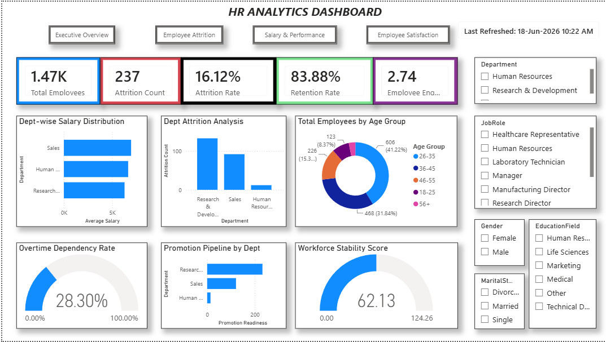
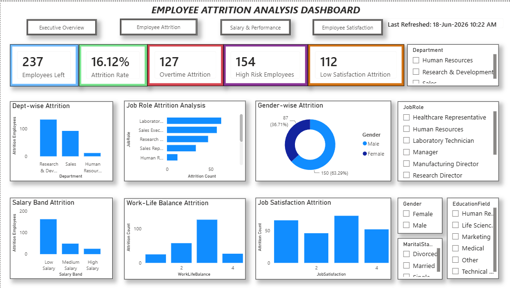
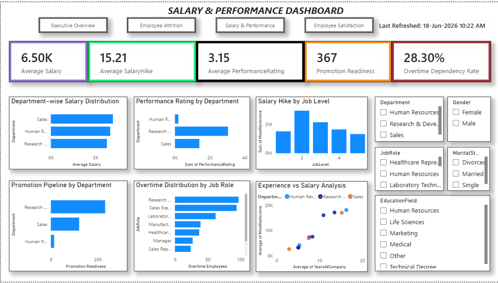
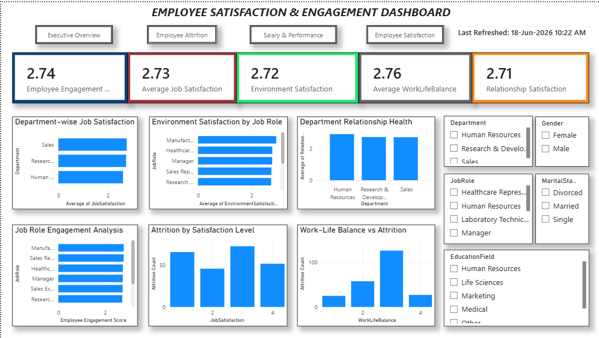

# 📊 HR Analytics Dashboard (Power BI)

## Project Overview

The **HR Analytics Dashboard** is an interactive Power BI project designed to analyze workforce data and generate meaningful insights for HR decision-making. This dashboard helps organizations monitor employee attrition, retention, salary trends, performance metrics, workforce stability, and employee satisfaction.

The objective of this project is to identify workforce patterns, understand employee behavior, and support strategic HR planning through data-driven insights.

---

## 🛠 Tools & Technologies

* **Power BI Desktop**
* **Power Query**
* **DAX (Data Analysis Expressions)**
* **Data Modeling**
* **Data Visualization**

---

## 📂 Data Model

To improve performance and maintain a structured relationship model, the dataset was split into **three related tables**.

### 1. Employee Details Table

Contains employee demographic and organizational information.

**Columns:**

* EmployeeNumber
* Age
* Gender
* Department
* JobRole
* Education
* EducationField
* MaritalStatus
* BusinessTravel
* DistanceFromHome

---

### 2. Job Performance Table

Contains salary and performance-related employee information.

**Columns:**

* EmployeeNumber
* MonthlyIncome
* DailyRate
* HourlyRate
* JobLevel
* JobInvolvement
* PerformanceRating
* PercentSalaryHike
* OverTime

---

### 3. Attrition & Satisfaction Table

Contains employee attrition and satisfaction metrics.

**Columns:**

* EmployeeNumber
* Attrition
* JobSatisfaction
* EnvironmentSatisfaction
* RelationshipSatisfaction
* WorkLifeBalance
* NumCompaniesWorked
* StockOptionLevel

---

## 📈 Key Performance Indicators (KPIs)

This dashboard includes the following important HR KPIs:

* Total Employees
* Attrition Count
* Attrition Rate
* Retention Rate
* Average Salary
* Average Salary Hike
* Average Performance Rating
* Employee Engagement Score
* Overtime Dependency Rate
* Promotion Readiness
* Workforce Stability Score

---

## 📑 Dashboard Pages

### 1. Executive Overview Dashboard

Provides a high-level overview of workforce performance and organizational health.

**Insights Covered:**

* Employee Count
* Attrition Summary
* Salary Distribution
* Age Group Analysis
* Overtime Dependency
* Promotion Pipeline

---

### 2. Employee Attrition Analysis Dashboard

Focused on analyzing employee turnover patterns and identifying major attrition drivers.

**Insights Covered:**

* Department-wise Attrition
* Job Role Attrition Analysis
* Gender-wise Attrition
* Salary Band Attrition
* Work-Life Balance Attrition
* Job Satisfaction Attrition

---

### 3. Salary & Performance Dashboard

Analyzes employee compensation, salary growth, performance, and overtime trends.

**Insights Covered:**

* Salary Distribution
* Performance Rating Analysis
* Salary Hike Analysis
* Promotion Readiness
* Overtime Analysis
* Experience vs Salary Analysis

---

### 4. Employee Satisfaction & Engagement Dashboard

Measures employee satisfaction levels and engagement metrics.

**Insights Covered:**

* Job Satisfaction
* Environment Satisfaction
* Work-Life Balance
* Relationship Satisfaction
* Employee Engagement Analysis
* Satisfaction vs Attrition Analysis

---

## 🚀 Project Highlights

* Designed a structured relational data model
* Built **15+ DAX measures** for advanced analysis
* Developed **4 interactive dashboard pages**
* Implemented navigation buttons for page switching
* Added dynamic refresh indicators
* Created professional KPI cards and charts
* Enabled dynamic filtering using slicers
* Built business-focused HR insights

---

## 📊 Business Insights

* Research & Development department has the highest employee attrition.
* Employees with lower salary bands show higher attrition rates.
* Overtime employees are more likely to leave the organization.
* Work-life balance has a strong impact on employee retention.
* Promotion readiness varies significantly across departments.
* Employee satisfaction directly affects workforce stability.

---

## 📷 Dashboard Screenshots

### Executive Overview

---

### Employee Attrition Analysis

---

### Salary & Performance Dashboard

---

### Employee Satisfaction & Engagement Dashboard

---

## 📁 Dataset

**IBM HR Analytics Employee Attrition Dataset**

---

## 💡 Skills Demonstrated

This project showcases practical skills in:

* Data Cleaning
* Data Transformation
* Data Modeling
* DAX Calculations
* Dashboard Design
* HR Business Analysis
* Data Storytelling

---

## 👨‍💻 Author

**Gowsik N**
**B.Tech – Artificial Intelligence and Data Science**

Aspiring Data Analyst | Power BI Developer | Data Science Enthusiast
